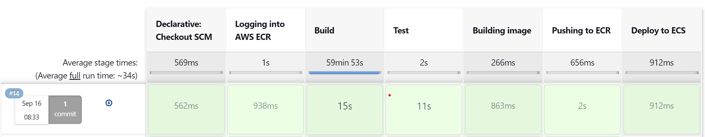
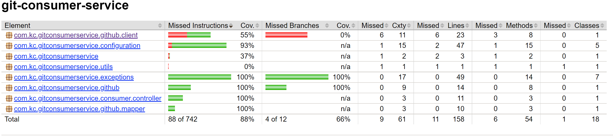

# Git Consumer Service

Git Consumer Service is microservice which get user’s non-forked repository from github.com and display in custom defined schema for client applications.Service is using https://api.github.com to get user’s repository and filter only non-forked repository to return for client. Service is developed in reactive fremwork using Spring Boot WebFlux with Netty.

## Build

./mvn spring-boot:build

## Package the Jar

```bash
./mvn spring-boot:package
```

## Run Unit Test & Integration Test

./mvn spring-boot:test

## Run

```bash
./mvn spring-boot:run
```
Alternatively, you can build the JAR file with ```./mvnw clean package``` and then run the JAR file, as follows:
```java -jar target/gs-rest-service-0.1.0.jar```

## Building from Dockerfile
Dockerfile is present in projct's root folder from where you can build docker image and run on docker by running following commands:

```bash
docker build -t git-consumer-service:1.0 .
docker run -p 8080:8080 ${imageId}
```
Or DockerCompose is also present in projetc's root folder from where you can run git consumer service with following command in detach mode.

``` 
docker-compose up -d
- or -
docker-compose up --detach
  ```
## CI CD Pipeline

### prerequisites ###
* Jenkin Up & Running  (A reference how to setup Jenkin on AWS EC2 https://www.jenkins.io/doc/tutorials/tutorial-for-installing-jenkins-on-AWS/
* Docker is Installed on machine where Jenkin is Installed.
* JDK 17
* Maven > 3.5.x
* Configure AWS Role Access Key & Secret Key in Jenkin.
* Pipeline Item is created in Jenkin with SCM polling with ```Jenkinsfile```.
* ```Jenkinsfile``` is present in project's root folder with Stages (Checkout SCM, Login to ECR, Build, Test, Build Image, Pushing to ECR, Deploy to ECS)
* Before running the pipeline follow below steps:
                   
      1. go to cf_templates under project root.
      2. Update AWS Properties with actauls in template_service.yaml.
      3. Create stacks with template_service.yaml cloud formation template.
      4. Run the pipeline and you should able to see all of your staging are completed successfuly then check your service ir up and running by ELB URL.

  


## API Documentation

http://$HOST_NAME:$PORT:/swagger-ui.html

## Technologies

* Java 17
* Spring Boot 2.7.3

## Spring Components

#### Spring WebFlux ####
* Service is using Spring WebFlux - The reactive-stack web framework with Netty which is fully non-blocking, supports Reactive Streams back pressure. 
#### Spring Security ###
* Service is using Basic authenication and a user is configured in SecurityConfig.java, in real world OAuth2, IAM, JWT, DB Auth or third partyModel Identify provider should be used.
#### Spring Cloud Circuit Breaker ####
* Spring Cloud Circuit breaker provides an abstraction across different circuit breaker implementations and service is using with Resilence4j.Currenctly service is using @RateLimiter to limit the API call 3 in one minute but in real time scenario should be alo using @Retry or @CircuitBreaker with fallback method where you can return the result from cache to make your service fault-tolerance. 
#### Spring Cache with Caffene ####
* Service is using Spring cache with Caffene impmentaion to reducing the number of executions based on the information available in the cache.
* Currently service is using 5 min duration to keep cache.
* You can modify time by updating property ```api.cache.duration``` in ```application.yml``` under resources.

#### OpenAPI 3.0 with Swagger UI ####

* SpringDoc — a tool that simplifies the generation and maintenance of API docs based on the OpenAPI 3 specification for Spring Boot, service is using OpenAPI 3 with Swagger UI so that we can interact with our API specification and exercise the endpoints.

#### Project Lombok ####
* Lombok is a Java library tool that generates code for minimizing boilerplate code. The library replaces boilerplate code with easy-to-use annotations.
* We are using Lombok annotaion to generate out Getter/Setter/Builder etc for almost all of our DTOs.

#### Logging with Log4j2 ####

* Service is using Spring Boot Logging with Log4j2 for logging.
* Logging settings can be modified by modifying logging definations from ```log4j2-spring.xml```

#### Global Exception Handler ####

* GitConsumerService is handling custom exception by overriding reactive default exception handler.
* Currently service is returning status and message if there is custom exception is thrown by service but you can modify the behavior by updating ```com.kc.gitconsumerservice.exceptions.ErrorAttributesKey```
* You can customize the behavior of response for custom exceptions by updating ```GlobalErrorAttributes.java & GlobalErrorWebExceptionHandler.java ``` under ```exceptions``` package.

#### Code Coverage ####
* Git Consumer service is using ````jacoco-maven-plugin```` to generate code coverage report.
  

## API Documentation

* As GitConsumer service is using OpenAPI 3.0 with Swagger UI so you can see all api definition at below URL:

````http://$HOST_NAME:PORT/swagger-ui.html ````

* Get All Non=forked User repository (If service is running locally, you can change hostname and port accordengly)
By default if you do not pass ``page`` & ``size`` as Query Param then service set by default page=1 and size=30
```` http://localhost:8081/api/v1/git-repo/{username}````

* ````Basic Auth: username=user, password=password````

Response:
````aidl
 [{
        "name": "ButterKnifeDroid",
        "ownerLogin": "kjoshi07",
        "branches": [
            {
                "name": "master",
                "sha": "78110733c42abccb075bbacfc38f06a22bf8591e"
            }
        ]
    },...]

````

* Get All Non=forked User repository with pagignation params (pass username as github valid username)

```` http://localhost:8081/api/v1/git-repo/{validgithubuser}?page=1&size=10````
  
````Basic Auth: username=user, password=password````

Response:
````aidl
 [{
        "name": "ButterKnifeDroid",
        "ownerLogin": "kjoshi07",
        "branches": [
            {
                "name": "master",
                "sha": "78110733c42abccb075bbacfc38f06a22bf8591e"
            }
        ]
    },...]

````
* Get All Non=forked User repository with invalid github user

```` http://localhost:8081/api/v1/git-repo/{invalidgihutuser}?page=1&size=10````

```` Basic Auth: username=user, password=password````

Response:
````aidl
 {
    "message": "User is not found in github!",
    "status": 404
}

Note: Pagignation might not return same number as expected for example if you are requesting for page 1 with size 10, api might return lass than 10 repo as service itself filter user's non forked repository so github.com might return 10 repository if exists for user but there might be only 5 non-forked respitory so service will only return 5.


## License

[MIT](https://choosealicense.com/licenses/mit/)